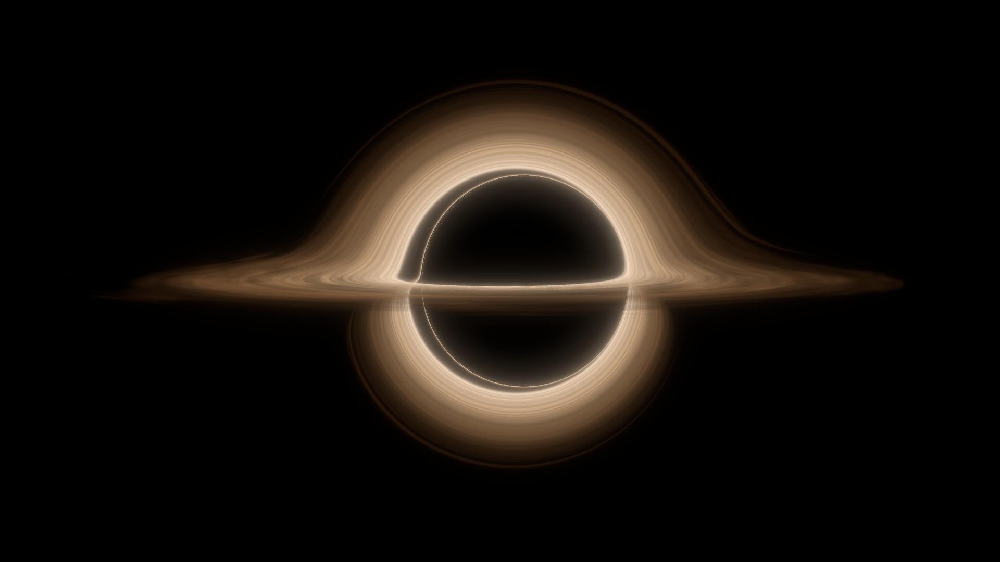
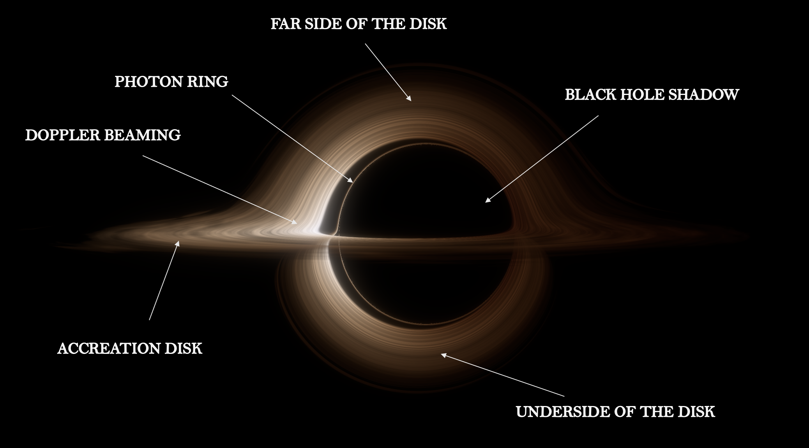
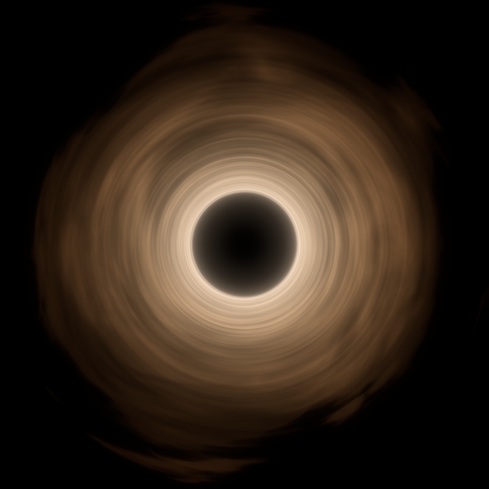
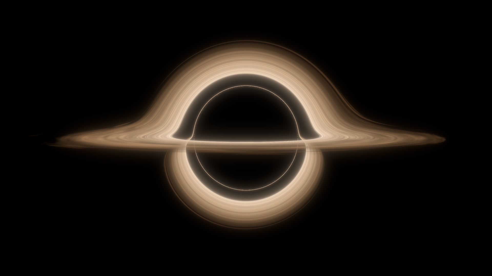
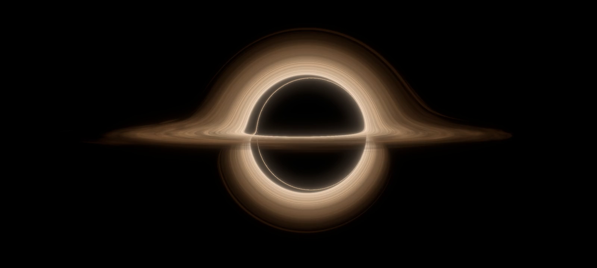
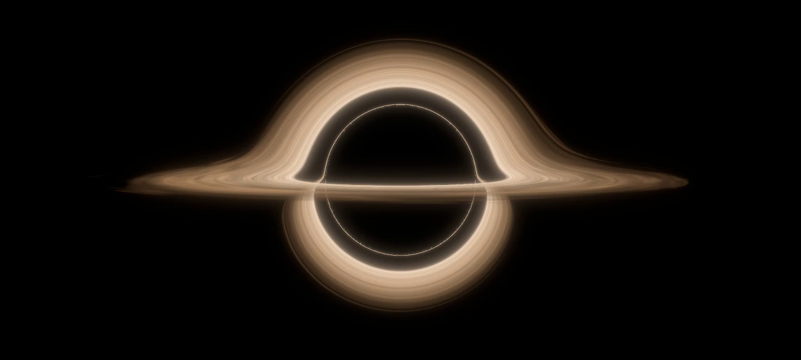
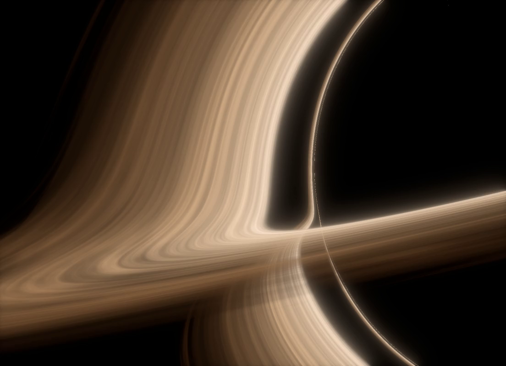

# black-hole

[](https://github.com/IakOBiaN/black-hole/actions/workflows/tests.yml)


A physically accurate, modern, and visually compelling black hole renderer.

The goal is an image on par with the black hole in *Interstellar*, built from
first principles: tracing light rays through curved spacetime and rendering the
gravitationally lensed view a camera near the hole would actually see.



## Anatomy

The physics frame (`--mode accurate`): every structure general relativity
demands is present - the shadow, the photon ring hugging it, the near side
of the disk crossing in front, the far side lensed over the top, the
underside lensed beneath, and Doppler beaming brightening the approaching
side. Rendered clean, for hand annotation.



## Other views

| Pole-on (down the spin axis) | No spin (a = 0, Schwarzschild) |
|---|---|
|  |  |

Looking straight down the spin axis the shadow is round, the photon ring
closes into a full halo and the spiral gas flow is seen face-on. With the
spin turned off the picture becomes left-right symmetric and the disk's
inner edge retreats to the Schwarzschild ISCO at 6M.

Close-up at the shadow's edge, the disk crossing the frame:


## Animations

The gas orbits the hole differentially: the inner rings lap the outer
ones, shearing the pattern as time runs.



The spin sweep morphs between the two stills above: from the Schwarzschild
frame (a = 0) to the movie frame (a = 0.6), with the disk's inner edge
following the shrinking ISCO (6M down to 3.83M). Higher spins are physical
but increasingly unreadable - the blazing inner gas starts to veil the
shadow.



Close-up on the shadow's edge with the gas streaming past:



Two rendering modes are available throughout:

- **accurate** - physically faithful (no artistic adjustments)
- **beautiful** - the movie treatment: no frequency shifts (as chosen by
  Nolan and Franklin), plus a soft veiling glow standing in for IMAX lens
  flare

The reference is James, von Tunzelmann, Franklin & Thorne (2015), *Gravitational
lensing by spinning black holes in astrophysics, and in the movie Interstellar*.

## Usage

Snapshots - every parameter is a flag (`python main.py --help`):

```bash
python main.py                              # the default Interstellar frame
python main.py --spin 0.998 --fov 24        # near-extremal Gargantua
python main.py --time 150 --azimuth 90      # later; camera swung 90 deg
python main.py --mode accurate              # full Doppler physics (Fig 15c)
```

Animations (`python animate.py --help`) - in every mode time runs and the
disk gas orbits differentially:

```bash
python animate.py --anim time               # fixed camera, orbiting gas
python animate.py --anim orbit              # camera circles the hole
python animate.py --anim spin --track-isco --spin-to 0.6
```

Camera and look keys are shared with main.py, so any framing found with a
still animates unchanged. The output format follows the `--out` extension:
`.mp4` (H.264, `--crf` quality knob) is an order of magnitude smaller than
`.gif` with no palette banding: best with width and height divisible
by 16. The animations are embedded in this README as GitHub-hosted videos
(drag the .mp4 into the README editor on github.com), so the repository
itself stays light.

The gallery above regenerates with:

```bash
python main.py --width 1920 --height 1080 --fov 21 --supersample 2 --out media/blackhole.png
python main.py --mode accurate --saturation 0.75 --bloom 0.3 --width 1920 --height 1080 --fov 21 --supersample 2 --out media/anatomy.png
python main.py --inclination 90 --fov 34 --width 1080 --height 1080 --supersample 2 --max-steps 45000 --out media/topdown.png
python main.py --spin 0 --width 1920 --height 1080 --fov 21 --supersample 2 --out media/schwarzschild.png
python main.py --fov 6.2 --aim-x -2.5 --aim-y 2.3 --roll 10 --width 1412 --height 1200 --supersample 2 --out media/closeup.png
python animate.py --anim time --frames 144 --step 2 --fps 24 --width 1600 --height 720 --supersample 2 --out media/anim_time.mp4
python animate.py --anim time --frames 216 --step 0.75 --fps 24 --fov 6.2 --aim-x -4 --aim-y 0 --roll 13 --width 1104 --height 800 --supersample 2 --out media/anim_closeup.mp4
python animate.py --anim spin --track-isco --spin-from 0 --spin-to 0.6 --frames 64 --step 2 --fps 16 --width 1280 --height 576 --supersample 2 --out media/anim_spin.mp4
```

The default geometry follows the paper's Fig. 15a: spin a/M = 0.6, camera
at r = 74.1M, 3.44° above the disk plane; the disk reaches in to the ISCO
and dims and reddens toward its edge (T ∝ r^-0.45 blackbody).

## What is implemented

- Backward ray tracing of the received photon's null geodesic through the
  Kerr metric in Boyer-Lindquist coordinates (super-Hamiltonian form,
  integrated backward in time per the DNGR prescription), Numba-compiled
  and parallelized.
- A physically thin, marginally optically thick artist-style disk: fine
  filaments stretched along the orbital flow, ring gaps, a ragged outer
  edge with sparse debris beyond it. Rays record every crossing of the
  equatorial plane and the lensed layers are composited front to back with
  the material's opacity.
- Blackbody shading with Doppler + gravitational frequency shift of disk
  material on prograde circular geodesics: colour shift and relativistic
  beaming (I ∝ g⁴), with the paper's three treatments selectable
  (`shift_mode = "none" | "hue" | "full"`).
- Multi-scale bloom and a filmic tone map.
- A Schwarzschild fast path (`src/tracer.py`) kept from the earlier
  roadmap stages.

## Validation

The physics is exercised by a test suite (geodesic conservation, shadow
size against the analytic critical impact parameter, frame-dragging
direction, Doppler sign end to end, Liouville I ∝ g⁴ scaling, Numba/NumPy
tracer parity) and by reproducing the DNGR paper's published figures: the
lensed dome, front band and bottom arc of Fig. 15a land within a few
percent of the article's measured proportions, and the shadow flattens on
the approaching side exactly as in its Fig. 14.

## Performance

Numba-compiled, parallel across all CPU cores: a 1100×500 frame with 3×
supersampling (~5M geodesics, each integrated through the Kerr metric with
adaptive RK4) renders in a couple of minutes on a laptop. Animations reuse
a single geometry pass where the spacetime allows it - the Kerr metric is
axisymmetric and static, so orbiting-gas and camera-orbit sequences only
re-shade per frame.

## References

- O. James, E. von Tunzelmann, P. Franklin, K. S. Thorne,
  *Gravitational lensing by spinning black holes in astrophysics, and in
  the movie Interstellar*, Class. Quantum Grav. **32** 065001 (2015) —
  [doi:10.1088/0264-9381/32/6/065001](https://doi.org/10.1088/0264-9381/32/6/065001),
  [arXiv:1502.03808](https://arxiv.org/abs/1502.03808). The DNGR paper this
  renderer follows: ray-tracing prescription, disk geometry, and the
  reference figures used for validation.
- K. S. Thorne, *The Science of Interstellar*, W. W. Norton (2014).

## Setup

Python 3.11+:

```bash
python -m venv .venv
source .venv/bin/activate   # Windows: .venv\Scripts\activate
pip install -r requirements.txt
pytest tests -q             # optional: verify the physics
```

## Layout

```
src/      source code
media/    committed gallery renders (regenerate with the commands above)
out/      working renders (git-ignored)
```
